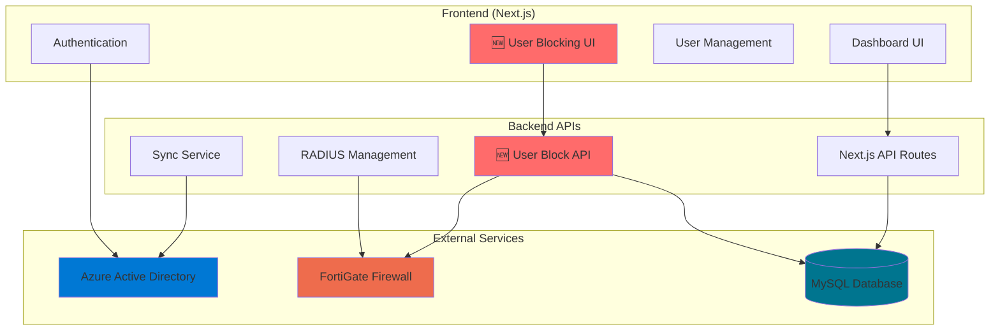
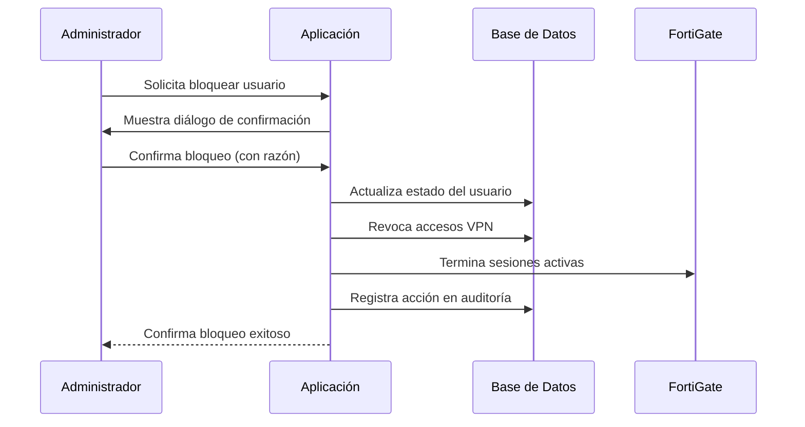
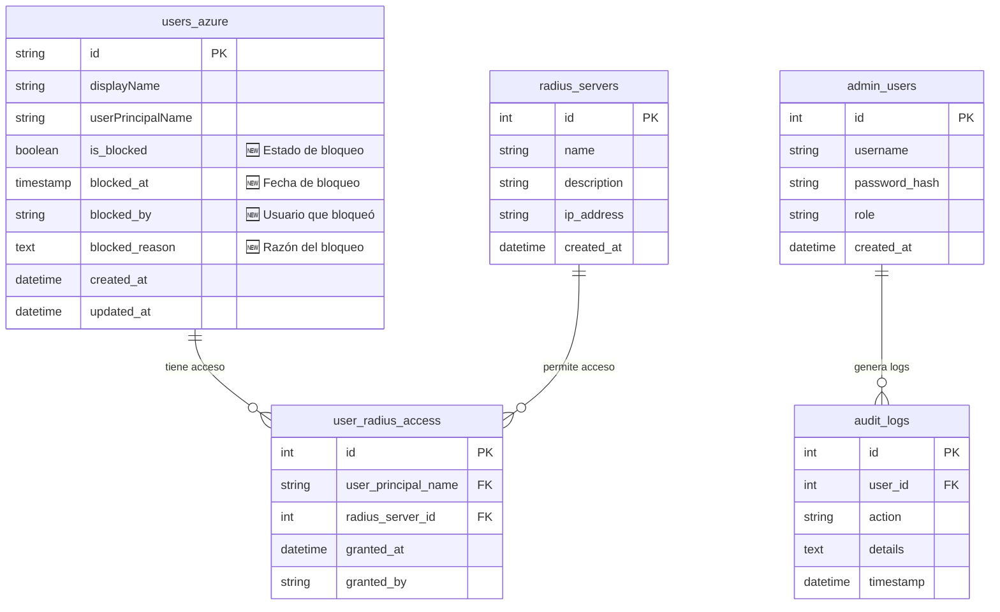
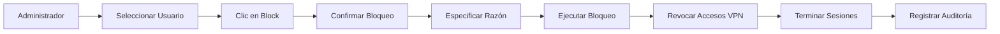
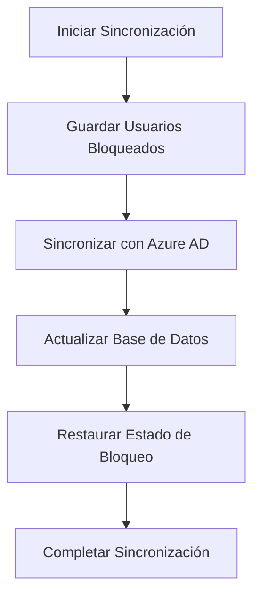

# 🌐 Azure VPN Management System

Sistema integral de gestión de VPN con funcionalidad de bloqueo de usuarios.

## 📋 Descripción

Sistema integral de gestión de VPN que integra Azure Active Directory con FortiGate para proporcionar autenticación centralizada y control granular de acceso VPN. La aplicación permite administrar usuarios de múltiples dominios corporativos, gestionar sus permisos de acceso a diferentes servidores VPN, y **bloquear/desbloquear usuarios** según sea necesario.

## ✨ Características Principales

- 🔐 **Autenticación con Azure AD**: Integración completa con Azure Active Directory
- 🌍 **Soporte Multi-Dominio**: Configurable para múltiples dominios de email
- 🛡️ **Gestión de Acceso VPN**: Control granular de acceso a servidores RADIUS/VPN
- 🚫 **🆕 Bloqueo de Usuarios**: Capacidad de bloquear/desbloquear usuarios con auditoría completa
- 📊 **Dashboard Interactivo**: Interfaz moderna para administración de usuarios
- 🔄 **Sincronización Automática**: Sincronización bidireccional con Azure AD que preserva el estado de bloqueo
- 📝 **Auditoría y Logs**: Registro completo de actividades y cambios
- 🎯 **Gestión de Portales VPN**: Configuración de múltiples portales FortiGate
- 🔒 **Autenticación Basada en Roles**: Sistema de permisos administrativos
- 🐍 **Scripts Python Utilitarios**: Scripts especializados para gestión de sesiones VPN y grupos

## 🏗️ Arquitectura del Sistema



## 🆕 Nueva Funcionalidad: Bloqueo de Usuarios

### Características del Sistema de Bloqueo

- **Bloqueo Inmediato**: Al bloquear un usuario se revocan automáticamente todos sus accesos VPN
- **Terminación de Sesiones**: Las sesiones VPN activas del usuario se terminan inmediatamente
- **Auditoría Completa**: Registro de quién bloqueó al usuario, cuándo y por qué razón
- **Preservación de Estado**: Durante la sincronización con Azure AD se preserva el estado de bloqueo
- **Interfaz Visual**: Indicadores visuales claros del estado del usuario en el dashboard

### Flujo de Bloqueo de Usuario



## 🗂️ Estructura del Proyecto

```
azure-vpn/
├── 📁 app/                     # Next.js App Router
│   ├── 📁 api/                # API Routes
│   │   ├── 📁 auth/           # Autenticación
│   │   ├── 📁 users/          # Gestión de usuarios
│   │   │   └── 📁 block/      # 🆕 Endpoint de bloqueo
│   │   ├── 📁 domains/        # Configuración de dominios
│   │   ├── 📁 radius/         # Gestión RADIUS
│   │   └── 📁 vpn-portals/    # Portales VPN
│   ├── 📄 page.tsx            # Dashboard principal
│   ├── 📄 login/page.tsx      # Página de login
│   └── 📄 layout.tsx          # Layout base
├── 📁 components/             # Componentes React
│   ├── 📄 DashboardClient.tsx # Dashboard con funcionalidad de bloqueo
│   ├── 📄 UserAccessManagement.tsx # Gestión de acceso
│   └── 📁 ui/                 # Componentes UI base
├── 📁 lib/                    # Librerías y utilidades
│   ├── 📄 azure.ts           # Cliente Azure AD
│   ├── 📄 domains.ts         # Gestión de dominios
│   ├── 📄 db.ts              # Conexión base de datos
│   └── 📄 auth.ts            # Autenticación JWT
├── 📁 scripts/               # Scripts de utilidades
│   ├── 📄 init-db.js         # Inicialización BD
│   ├── 📄 init-db.sql        # 🆕 Esquema actualizado con campos de bloqueo
│   ├── 📄 create-admin.js    # Crear usuario admin
│   ├── 📄 terminate_vpn_session.py # 🆕 Gestión de sesiones VPN
│   ├── 📄 revoke_access.py   # 🆕 Revocación de acceso de grupos
│   └── 📄 fortigate_ssh.py   # 🆕 Consulta de grupos VPN
├── 📄 .env.local             # Variables de entorno
├── 📄 docker-compose.yml     # Configuración Docker
├── 📄 Dockerfile            # Imagen Docker
└── 📄 README.md             # Este archivo
```

## 📊 Base de Datos Actualizada

### Esquema Principal con Funcionalidad de Bloqueo



## ⚙️ Configuración

### Variables de Entorno Requeridas

```bash
# ===== CONFIGURACIÓN AZURE AD =====
AZURE_TENANT_ID=tu_tenant_id
AZURE_CLIENT_ID=tu_client_id
AZURE_CLIENT_SECRET=tu_client_secret

# ===== CONFIGURACIÓN BASE DE DATOS =====
DB_HOST=localhost
DB_PORT=3306
DB_USER=tu_usuario_db
DB_PASSWORD=tu_password_db
DB_NAME=azure_vpn

# ===== CONFIGURACIÓN DE LA APLICACIÓN =====
JWT_SECRET=tu_jwt_secret_seguro
NODE_ENV=production
PORT=3000

# ===== CONFIGURACIÓN SSL =====
SSL_KEY_PATH=./server.key
SSL_CERT_PATH=./server.crt

# ===== CONFIGURACIÓN FORTIGATE =====
FORTIGATE_API_URL=https://tu-fortigate-ip:443/api/v2
FORTIGATE_API_TOKEN=tu_api_token
FORTIGATE_IP=tu_fortigate_ip
FORTIGATE_SSH_PORT=22
FORTIGATE_SSH_USERNAME=tu_usuario_ssh
FORTIGATE_SSH_PASSWORD=tu_password_ssh

# ===== CONFIGURACIÓN DOMINIOS PERMITIDOS =====
ALLOWED_DOMAINS=@globalhitss.com,@hitss.com
```

## 🚀 Instalación y Deployment

### 1. Prerrequisitos

- Docker y Docker Compose instalados
- Certificados SSL válidos
- Acceso a Azure AD con permisos de lectura de usuarios
- Acceso administrativo a FortiGate

### 2. Clonar el Repositorio

```bash
git clone <url-del-repositorio>
cd azure-vpn
```

### 3. Configurar Variables de Entorno

```bash
# Crear archivo de configuración
nano .env.local
```

### 4. Preparar Certificados SSL

```bash
# Copiar certificados al directorio raíz
cp tu-certificado.crt server.crt
cp tu-clave-privada.key server.key
```

### 5. Inicializar Base de Datos

```bash
# Ejecutar script de inicialización (incluye campos de bloqueo)
node scripts/init-db.js

# Crear usuario administrador
node scripts/create-admin.js
```

### 6. Deployar con Docker

```bash
# Construir e iniciar servicios
docker-compose up -d

# Verificar logs
docker-compose logs -f app_azure
```

### 7. Acceder a la Aplicación

- URL: `https://localhost:3000`
- Login con credenciales de administrador creadas en el paso 5

## 📚 API Endpoints

### Autenticación
- `POST /api/auth/login` - Iniciar sesión
- `GET /api/auth/me` - Obtener información del usuario actual
- `POST /api/auth/logout` - Cerrar sesión

### Gestión de Usuarios
- `GET /api/users` - Listar usuarios con paginación
- `POST /api/sync-users` - Sincronizar con Azure AD (preserva estado de bloqueo)
- `GET /api/users-with-access` - Usuarios con acceso VPN

### 🆕 Bloqueo de Usuarios
- `POST /api/users/block` - Bloquear/desbloquear usuario
  ```json
  {
    "userPrincipalName": "usuario@domain.com",
    "action": "block|unblock",
    "reason": "Razón del bloqueo (opcional)"
  }
  ```

### Configuración de Dominios
- `GET /api/domains` - Obtener dominios permitidos configurados

### Gestión RADIUS
- `GET /api/radius/servers` - Listar servidores RADIUS
- `GET /api/radius/user-access` - Accesos de usuario
- `POST /api/radius/user-access` - Otorgar acceso
- `DELETE /api/radius/user-access/{userId}` - Revocar acceso

### Portales VPN
- `GET /api/vpn-portals` - Listar portales VPN
- `GET /api/vpn-portals/{id}` - Obtener portal específico

## 🐍 Scripts de Python Utilitarios

El sistema incluye varios scripts de Python que proporcionan funcionalidad crítica para la gestión de VPN y usuarios. Estos scripts interactúan directamente con el FortiGate mediante SSH para realizar operaciones administrativas.

### 📁 `scripts/terminate_vpn_session.py`

**Propósito:** Gestión de sesiones VPN activas en FortiGate

**Funcionalidades:**
- **Listar sesiones VPN activas**: Obtiene una lista de todas las sesiones SSL-VPN conectadas
- **Terminar sesiones por usuario**: Termina todas las sesiones VPN de un usuario específico
- **Terminar sesión por índice**: Termina una sesión específica usando su índice

**Comandos disponibles:**
```bash
# Listar todas las sesiones VPN activas
python scripts/terminate_vpn_session.py list

# Terminar todas las sesiones de un usuario
python scripts/terminate_vpn_session.py terminate <usuario@dominio.com>

# Terminar una sesión específica por índice
python scripts/terminate_vpn_session.py terminate-index <índice>

# Mostrar información de debug
python scripts/terminate_vpn_session.py debug

# Mostrar ayuda
python scripts/terminate_vpn_session.py help
```

**Variables de entorno requeridas:**
```bash
FORTIGATE_IP=192.168.1.100
FORTIGATE_SSH_PORT=22
FORTIGATE_SSH_USERNAME=admin
FORTIGATE_SSH_PASSWORD=tu_password
```

**Salida JSON:**
```json
{
  "success": true,
  "message": "Terminated 2 VPN sessions for user 'juan.perez@empresa.com'",
  "terminated_sessions": [
    {"index": "5", "username": "juan.perez"},
    {"index": "7", "username": "juan.perez"}
  ]
}
```

**Casos de uso:**
- Se ejecuta automáticamente cuando se bloquea un usuario
- Monitoreo manual de sesiones activas
- Terminación forzada de sesiones problemáticas

### 📁 `scripts/revoke_access.py`

**Propósito:** Revocación de acceso de usuarios de grupos VPN en FortiGate

**Funcionalidad:**
- Conecta al FortiGate vía SSH
- Modifica la configuración de grupos de usuarios
- Remueve usuarios específicos de grupos VPN
- Mantiene la integridad de la configuración del grupo

**Uso:**
```bash
python scripts/revoke_access.py <nombre_grupo> <usuario_a_remover>
```

**Ejemplo:**
```bash
# Remover usuario del grupo VPN_USERS
python scripts/revoke_access.py "VPN_USERS" "juan.perez"
```

**Variables de entorno requeridas:**
```bash
FORTIGATE_IP=192.168.1.100
FORTIGATE_SSH_PORT=22
FORTIGATE_SSH_USERNAME=admin
FORTIGATE_SSH_PASSWORD=tu_password
```

**Salida JSON:**
```json
{
  "success": true,
  "message": "User 'juan.perez' has been removed from the group 'VPN_USERS'."
}
```

**Proceso interno:**
1. Conecta al FortiGate via SSH
2. Entra en modo de configuración de grupos
3. Obtiene la lista actual de miembros
4. Verifica que el usuario existe en el grupo
5. Crea nueva lista sin el usuario especificado
6. Actualiza la configuración del grupo
7. Guarda los cambios

### 📁 `scripts/fortigate_ssh.py`

**Propósito:** Consulta de miembros de grupos VPN

**Funcionalidad:**
- Obtiene la lista de miembros de un grupo específico en FortiGate
- Utilizado para verificar configuraciones actuales
- Proporciona información en formato JSON para integración con la aplicación

**Uso:**
```bash
python scripts/fortigate_ssh.py <nombre_grupo>
```

**Ejemplo:**
```bash
python scripts/fortigate_ssh.py "VPN_USERS"
```

**Variables de entorno requeridas:**
```bash
FORTIGATE_IP=192.168.1.100
FORTIGATE_SSH_PORT=22
FORTIGATE_SSH_USERNAME=admin
FORTIGATE_SSH_PASSWORD=tu_password
```

**Salida JSON:**
```json
{
  "group": "VPN_USERS",
  "members": [
    "juan.perez",
    "maria.garcia",
    "carlos.lopez"
  ]
}
```

### 🔧 Integración con la Aplicación

Los scripts se integran con la aplicación Next.js de las siguientes maneras:

**1. Bloqueo de usuarios:**
```javascript
// En app/api/system-users/block/route.ts
const result = await new Promise((resolve, reject) => {
  const pythonProcess = spawn('python3', [
    path.join(process.cwd(), 'scripts/terminate_vpn_session.py'),
    'terminate',
    userPrincipalName
  ]);
  // ... manejo de la respuesta
});
```

**2. Revocación de acceso:**
```javascript
// En app/api/revoke-access/route.ts
const revokeResult = await new Promise((resolve, reject) => {
  const pythonProcess = spawn('python3', [
    path.join(process.cwd(), 'scripts/revoke_access.py'),
    groupName,
    username
  ]);
  // ... manejo de la respuesta
});
```

### 🛠️ Configuración y Requisitos

**Dependencias de Python:**
```bash
pip install paramiko python-dotenv
```

**O usando el archivo requirements.txt:**
```bash
pip install -r requirements.txt
```

**Permisos requeridos en FortiGate:**
- Usuario SSH con permisos administrativos
- Acceso a configuración de grupos de usuarios
- Permisos para ejecutar comandos de gestión de sesiones VPN

### 🔍 Debugging y Logs

**Logs de debug:**
Los scripts generan logs detallados que se envían a `stderr`:
```bash
python scripts/terminate_vpn_session.py debug 2> debug.log
```

**Archivos de salida:**
- `vpn_list_output.txt`: Salida completa del comando `execute vpn sslvpn list`
- `vpn_terminate_index_X_output.txt`: Salida de terminación de sesión específica

**Verificación de conectividad:**
```bash
# Test básico de conexión SSH
ssh admin@192.168.1.100 -p 22

# Test desde la aplicación
python scripts/terminate_vpn_session.py debug
```

### ⚠️ Consideraciones de Seguridad

**Credenciales:**
- Las credenciales SSH se almacenan en variables de entorno
- Nunca hardcodear credenciales en los scripts
- Usar cuentas SSH dedicadas con permisos mínimos necesarios

**Timeouts y reconexión:**
- Los scripts implementan timeouts para evitar conexiones colgadas
- Manejo de errores de conexión y reconexión automática
- Logs detallados para troubleshooting

**Validación de entrada:**
- Validación de parámetros antes de ejecutar comandos
- Sanitización de nombres de usuario y grupos
- Manejo seguro de caracteres especiales

## 🎯 Casos de Uso Principales

### 1. Bloqueo de Usuario



### 2. Sincronización con Preservación de Estado



## 🔧 Interfaz de Usuario

### Dashboard Actualizado

El dashboard ahora incluye:

- **Columna de Estado**: Muestra si el usuario está activo o bloqueado
- **Indicadores Visuales**: Íconos y colores para identificar usuarios bloqueados
- **Botones de Acción**: Botón de bloqueo/desbloqueo junto al botón de gestión de acceso
- **Filas Resaltadas**: Los usuarios bloqueados aparecen con fondo rojizo y opacidad reducida

### Diálogo de Bloqueo

- **Confirmación Clara**: Mensaje descriptivo de la acción a realizar
- **Campo de Razón**: Textarea opcional para especificar la razón del bloqueo
- **Información de Bloqueo Previo**: Muestra detalles del bloqueo anterior al desbloquear
- **Estados de Carga**: Indicadores visuales durante el proceso

## 🔒 Seguridad y Auditoría

### Registros de Auditoría

Todas las acciones de bloqueo/desbloqueo se registran con:
- Usuario que ejecutó la acción
- Fecha y hora exacta
- Razón del bloqueo (si se proporcionó)
- Detalles completos de la operación

### Permisos

- Solo usuarios con rol **admin** pueden bloquear/desbloquear usuarios
- Los usuarios bloqueados no pueden recibir accesos VPN
- La gestión de acceso está deshabilitada para usuarios bloqueados

## 🔧 Solución de Problemas

### Problemas Específicos de Bloqueo

#### Error: "User is already blocked"
- ✅ Verificar estado actual del usuario en la base de datos
- ✅ Refrescar el dashboard para obtener el estado más reciente

#### Sesiones VPN no se terminan
- ✅ Verificar conexión con FortiGate
- ✅ Comprobar credenciales SSH en `.env.local`
- ✅ Revisar logs de la aplicación para errores de VPN

#### Estado de bloqueo se pierde en sincronización
- ✅ Verificar que la sincronización complete correctamente
- ✅ Revisar logs para confirmar que se restauró el estado de bloqueo
- ✅ Comprobar campos de bloqueo en la base de datos

### Logs Específicos

```bash
# Ver logs de bloqueo de usuarios
docker-compose logs -f app_azure | grep -i "block\|unblock"

# Ver logs de terminación de sesiones VPN
docker-compose logs -f app_azure | grep -i "vpn\|session"

# Ver logs de sincronización
docker-compose logs -f app_azure | grep -i "sync\|restaur"
```

## 🆕 Novedades en esta Versión

### Funcionalidades Agregadas

1. **Sistema de Bloqueo de Usuarios**
   - Bloqueo/desbloqueo con un clic
   - Razón del bloqueo configurable
   - Auditoría completa

2. **Mejoras en la Sincronización**
   - Preservación del estado de bloqueo
   - Logs detallados del proceso
   - Manejo mejorado de errores

3. **Interfaz Actualizada**
   - Indicadores visuales de estado
   - Diálogos de confirmación mejorados
   - Experiencia de usuario optimizada

4. **Base de Datos Extendida**
   - Nuevos campos para gestión de bloqueo
   - Índices optimizados
   - Esquema versionado

## 🤝 Contribución

1. Fork el repositorio
2. Crear rama para nueva funcionalidad (`git checkout -b feature/nueva-funcionalidad`)
3. Commit cambios (`git commit -am 'Agregar nueva funcionalidad'`)
4. Push a la rama (`git push origin feature/nueva-funcionalidad`)
5. Crear Pull Request

## 📄 Licencia

Este proyecto está bajo la Licencia MIT - ver el archivo [LICENSE](LICENSE) para detalles.

## 🆘 Soporte

Para soporte técnico:
- 📧 Email: soporte@empresa.com
- 📋 Issues: [GitHub Issues](https://github.com/tu-repo/issues)
- 📖 Wiki: [Documentación Extendida](https://github.com/tu-repo/wiki)

## 🔄 Changelog

### v2.1.0 (Diciembre 2024)
- ✅ Agregado sistema de bloqueo/desbloqueo de usuarios
- ✅ Preservación de estado durante sincronización
- ✅ Interfaz actualizada con indicadores visuales
- ✅ Auditoría completa de acciones de bloqueo
- ✅ Terminación automática de sesiones VPN

### v2.0.0 (Diciembre 2024)
- ✅ Soporte para múltiples dominios configurables
- ✅ Nueva arquitectura de configuración
- ✅ Mejoras en sincronización con Azure AD

---

**Versión:** 2.1.0  
**Última actualización:** Diciembre 2024  
**Mantenido por:** Equipo de Infraestructura TI 